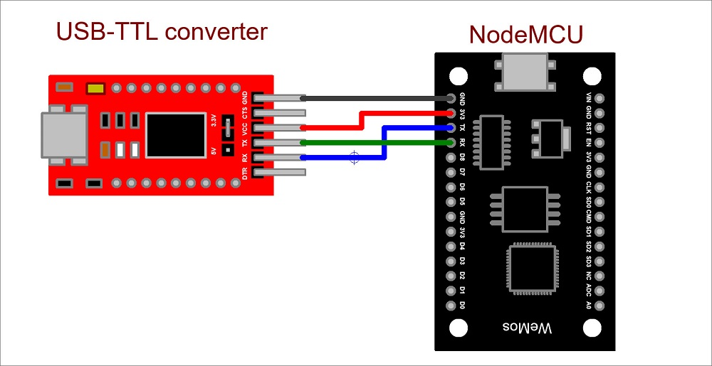

# Загрузка программы в NodeMCU с помощью USB-TTL конвертера FTDI на микросхеме FT232RL
[На главную](../rear%20protective%20light.md)
___
## Схема подключения

- NodeMCU подключается к USB-TTL конвертеру следующим образом:
    - Джампер (перемычка) устанавливающий напряжение, замыкает центральный контакт с контактом `3.3V`.
        - __ВАЖНО!__: если джампер установить на напряжение `5V`, то NodeMCU __выйдет из строя__.
    - Контакт `RX` платы NodeMCU к контакту `TX` ковертера.
    - Контакт `TX` платы NodeMCU к контакту `RX` ковертера.
    - Контакт `GND` платы NodeMCU к контакту `GND` ковертера.
    - Контакт `3V3` платы NodeMCU к контакту `VCC` ковертера.

## Загрузка прошивки в NodeMCU
1. Дожидаюсь компиляции.
2. Как только стартует загрузка, нажимаю и удерживаю кнопку FLASH на плате NodeMCU.
3. Удерживая FLASH нажимаю кнопку RESET (также на плате), плата перезапускается уже в режиме загрузки.
4. Вижу, что загрузка началась, отпускаю FLASH.
5. После окончания загрузки, нажимаю RESET и NodeMCU запускается в рабочем режиме.
6. Открываю COM-port и наблюдаю отладочную информацию, которую указал для вывода в COM-порт.
    - скорость на которой выводятся данные: 9600 бод.

